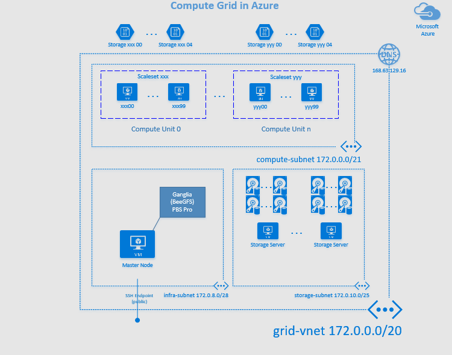

# Compute grid in Azure

These templates will build a compute grid made by a single master VMs running the management services, multiple VM Scaleset for deploying compute nodes, and optionally a set of nodes to run [BeeGFS](http://www.beegfs.com/) as a parallel shared file system. Ganglia is always setup by default on all VMs, and [PBS Pro](http://www.pbspro.org/) can optionally be setup for job scheduling.

Table of Contents
=================

* [VM Infrastructure](#vm-infrastructure)

# VM Infrastructure
The following diagram shows the overall Compute, Storage and Network infrastructure which is going to be provisioning within Azure to support running HPC applications.

### Network
A single VNET (__grid-vnet__) is used in which four subnets are created, one for the infrastructure (__infra-subnet__), one for the compute nodes (__compute-subnet__), one for the storage (__storage-subnet__) and one for the VPN Gateway (__GatewaySubnet__). The following addresses range is used :
* __grid-vnet 172.0.0.0/20__ allowing 4091 private IPs from 172.0.0.4 to 172.0.15.255
* __compute-subnet 172.0.0.0/21__ allowing 2043 private IPs from 172.0.0.4 to 172.0.7.255
* __infra-subnet 172.0.8.0/28__ allowing 11 private IPs from 172.0.8.4 to 172.0.8.15
* __gatewaysubnet 172.0.9.0/29__ allowing 3 private IPs from 172.0.9.4 to 172.0.9.7
* __storage-subnet 172.0.10.0/25__ allowing 251 private IPs from 172.0.10.4 to 172.0.10.255

Notice that Azure Network start each range at the x.x.x.4 address, reducing by 3 the number of available IPs in a subnet. So, this must be taken in account when designing your virtual network architecture.
Infiniband is automatically provided when HPC Azure nodes are provisioned.

For DNS, the Azure DNS is used for name resolution on the private IPs.

### Compute
Compute nodes are deployed thru VM Scale sets, made each by up to 100 VMs instances. They are all inside the compute-subnet. For each VM scale set, there can be up to 5 storage accounts to store the OS disks. The number 5 is chosen to not have more than 20 VMs stored into the same account to balance performance and resiliency.

### Storage
Depending on the workload to run on the cluster, there is a need to build a scalable file system. BeeGFS is proposed as an option, each storage node will host the storage and metadata services. Several Premium Disks are configured in RAID0 to store the metadata in addition to the real store.

### Management
A dedicated VM (the master node) is used as a jumpbox, exposing an SSH endpoint, and hosting these services :
* __Ganglia__ metadata service and monitoring web site
* __PBS Pro__ job scheduler
* __BeeGFS__ management services

# Deployment steps
To build the compute grid, three main steps need to be executed :
1. Create the networking infrastructure and the jumpbox
2. Optionally deploy the BeeGFS nodes
3. Provision the compute nodes

_The OS for this solution is CentOS 7.2. All scripts have been tested only for that version._

## Create the networking infrastructure and the jumpbox
The template __deploy-master.json__ will provision the networking infrastructure as well as a master VM exposing an SSH endpoint for remote connection.   

You have to provide these parameters to the template :
* _vmPrefix_ : a 8 characters prefix to be used to name your objects. The master VM will be named as **\[prefix\]master**
* _sharedStorage_ : to specify the shared storage to use. Allowed values are : none, beegfs.
* _scheduler_ : the job scheduler to be setup. Allowed values are : none, pbspro
* _masterImage_ : the OS to be used. Should be CentOS_7.2
* _VMSku_ : This is to specify the instance size of the master VM. For example Standard_DS3_v2
* _adminUsername_ : This is the name of the administrator account to create on the VM
* _adminPassword_ : Password to associate to the administrator account. It is highly encourage to use SSH authentication and passwordless instead.
* _sshKeyData_ : The public SSH key to associate with the administrator user

  

### Check your deployment
Once the deployment succeed, use the output **masterFQDN** to retrieve the master name and SSH on it. The output **GangliaURI** contains the URI of the Ganglia monitoring page, which should display after few minutes graphs of the current load.

To check if PBSPro is installed, run the command **pbsnodes -a** this should return no available nodes, but the command should run successfully.

BeeGFS will be checked later once the storage nodes will be deployed.

## Optionally deploy the BeeGFS nodes

If your compute cluster require a scalable shared file storage, you can deploy BeeGFS nodes to create a unique namespace. Prior doing your deployment you will have to decide how much storage nodes you will require and for each how much data disks you will provide for the storage and metadata services.
Data disks are based on Premium Storage and can have three different sizes :
* P10 : 128 GB
* P20 : 512 GB
* P30 : 1023 GB

The storage nodes will be included in the VNET created in the previous step, and all inside the *storage-subnet* .

The template __BeeGFS/deploy-beegfs.json__ will provision the storage nodes with CentOS 7.2 and BeeGFS version 2015.3.

You have to provide these parameters to the template :
* _nodeType_ : Default value is **both** and should be kept as is. Other values *meta* and *storage* are allowed for advanced scenarios in which meta data services and storage services are deployed on dedicated nodes.
* _nodeCount_ : Total number of storage nodes to deploy. Maximum is 100.
* _VMsku_ : The VM instance type to be used in the Standard_DSx_v2 series. Default is **Standard_DS3_v2**.
* _RGvnetName_ : The name of the Resource Group used to deploy the Master VM and the VNET.
* _adminUsername_ : This is the name of the administrator account to create on the VM. It is recommended to use the same than for the Master VM.
* _sshKeyData_ : The public SSH key to associate with the administrator user
* _masterName_ : The short name of the Master VM, on which the BeeGFS management service is installed
* _storageDiskSize_ : Size of the Data Disk to be used for the storage service (P10, P20, P30). Default is **P10**.
* _nbStorageDisks_ : Number of data disks to be attached to a single VM. Min is 2, Max is 8, Default is **2**.
* _metaDiskSize_ :  Size of the Data Disk to be used for the metadata service (P10, P20, P30). Default is **P10**.
* _nbMetaDisks_ : Number of data disks to be attached to a single VM. Min is 2, Max is 8, Default is **2**.
* _customDomain_ : If the VNET is configure to use a custom domain, specify the name of this custom domain to be used

  

### Check your deployment
Storage nodes will be named _beegfs00 ... beegfs99_ .
After few minutes, they should appear in the Ganglia monitoring web page.

To check that the nodes are well registered into the BeeGFS management service, SSH on the master VM and then run these commands :
* to list the storage nodes : *beegfs-ctl --listnodes --nodetype=storage*
* to list the metadata nodes : *beegfs-ctl --listnodes --nodetype=metadata*
* to display the BeeGFS file system : *beegfs-df*
* to display the BeeGFS network : *beegfs-net*

The mount point to use is **/share/scratch** , and it should already be mounted on the master VM.

## Provision the compute nodes
Compute nodes are provisioned using VM Scalesets, each set can have up to 100 VMs. You will have to provide the number of VM per scalesets and how many sets you want to create. All scalesets will contains the same VM instances.

You have to provide these parameters to the template :
* _VMsku_ : Instance type to provision. Default is **Standard_D3_v2**
* _sharedStorage_ : default is **none**. Allowed values are (beegfs, none)
* _scheduler_ : default is **none**. Allowed values are (pbspro, none)
* _computeNodeImage_ : OS to use for compute nodes. Default and recommended value is **CentOS_7.2**
* _vmSSPrefix_ : 8 characters prefix to use to name the compute nodes. The naming pattern will be **prefixAABBBBBB** where _AA_ is two digit number of the scaleset and _BBBBBB_ is the 8 hexadecimal value inside the Scaleset
* _instanceCountPerVMSS_ : number of VMs instance inside a single scaleset. Default is 2, maximum is 100
* _numberOfVMSS_ : number of VM scaleset to create. Default is 1, maximum is 100
* _RGvnetName_ : The name of the Resource Group used to deploy the Master VM and the VNET.
* _adminUsername_ : This is the name of the administrator account to create on the VM. It is recommended to use the same than for the Master VM.
* _adminPassword_ : Password to associate to the administrator account. It is highly encourage to use SSH authentication and passwordless instead.
* _sshKeyData_ : The public SSH key to associate with the administrator user
* _masterName_ : The short name of the Master VM

  

### Check your deployment
After few minutes, once the provision succeed, you should see the new hosts added on the Ganglia monitoring page.

If PBS Pro is used, SSH on the master and run the **pbsnodes -a** command to list all the registered nodes.

**Your cluster is now ready to host applications and run jobs**
____
